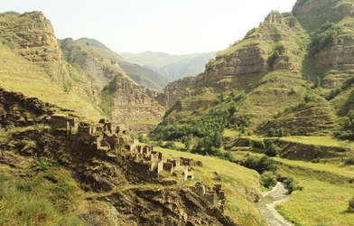

# Multi-CAST Sanzhi Dargwa

## How to cite

If you use these data please cite
- the original source
  > Forker, Diana & Schiborr, Nils N. 2023. Multi-CAST Sanzhi Dargwa. In Haig, Geoffrey & Schnell, Stefan (eds.), Multi-CAST: Multilingual corpus of annotated spoken texts. Version 2311. Bamberg: University of Bamberg. (multicast.aspra.uni-bamberg.de/#sanzhi) (date accessed)
- the derived dataset using the DOI of the [particular released version](../../releases/) you were using



## Description


**Sanzhi Dargwa** ([sanz1248](https://glottolog.org/resource/languoid/id/sanz1248)) is a Nakh-Daghestanian (Caucasian) language from the Dargwa subbranch. From 1968 onwards, over a relatively short time span, all Sanzhi speakers left their village of Sanzhi in the mountains of central Daghestan, Russia, to move to linguistically and ethnically heterogeneous settlements in the lowlands. Today Sanzhi is spoken by approximately 250 speakers and heavily endangered.

The eight texts in this corpus represent a small subset of the material that was recorded, transcribed, translated, and glossed by Diana Forker with the assistance of Gadzhimurad Gadzhimuradov, a native speaker, as part of a [DOBES language documentation project](http://dobes.mpi.nl/projects/shiri_sanzhi/) (2012–2019), which has culminated in a grammar of Sanzhi Dargwa ([Forker 2020](Source#cldf:forker2020)).

The texts presented here are a mixture of autobiographical and traditional narratives. They were annotated for Multi-CAST by Nils Schiborr.

The texts in this corpus (version 2207) are part of the [Sanzhi Dargwa data set](https://doreco.huma-num.fr/languages/sanz1248) in [DoReCo](https://doreco.huma-num.fr/), which has been time-aligned at the phone level.

This dataset is licensed under a CC-BY-4.0 license

Available online at https://multicast.aspra.uni-bamberg.de/#sanzhi


```geojson
{
    "type": "FeatureCollection",
    "features": [
        {
            "type": "Feature",
            "geometry": {
                "type": "Point",
                "coordinates": [
                    47.5667,
                    41.97796
                ]
            }
        },
        {
            "type": "Feature",
            "geometry": {
                "type": "Polygon",
                "coordinates": [
                    [
                        [
                            42.5667,
                            46.97796
                        ],
                        [
                            52.5667,
                            46.97796
                        ],
                        [
                            52.5667,
                            36.97796
                        ],
                        [
                            42.5667,
                            36.97796
                        ],
                        [
                            42.5667,
                            46.97796
                        ]
                    ]
                ]
            }
        }
    ]
}
```


## Corpus counts

Only a small number of basic GRAID symbols are counted:

*Function symbols*
- ⟨0⟩ zero
- ⟨pro⟩ definite pronoun
- ⟨np⟩ full noun phrase
- ⟨other⟩ form not further specified

*Person/Animacy symbols*
- ⟨.1⟩ first person
- ⟨.2⟩ second person
- ⟨.h⟩ third person, human
- ⟨.d⟩ third person, anthropomorphic
- ø third person, non-human

*Function symbols*
- ⟨:s⟩ subject of an intransitive clause
- ⟨:a⟩ subject of a transitive clause
- ⟨:ncs⟩ non-canonical subject
- ⟨:p⟩ direct object
- ⟨:obl⟩ oblique argument
- ⟨:g⟩ goal argument
- ⟨:l⟩ locational argument
- ⟨:pred⟩ predicate
- ⟨:poss⟩ possessive
- ⟨:other⟩ function not further specified

Only basic categories are listed; categories represented by complex symbols with additional
specifiers (e.g. ⟨dem_pro⟩ ‘demonstrative pronoun’) have been subsumed under the more basic
category (e.g. ⟨pro⟩ ‘definite pronoun’). Please refer to the annotation notes for this corpus for
information on all annotated categories, including those not listed here.

| GRAID | ⟨:s⟩ | ⟨:a⟩ | ⟨:ncs⟩ | ⟨:p⟩ | ⟨:obl⟩ | ⟨:g⟩ | ⟨:l⟩ | ⟨:pred⟩ | ⟨:poss⟩ | ⟨:other⟩ | totals |
|:--------------|-------:|-------:|---------:|-------:|---------:|-------:|-------:|----------:|----------:|-----------:|---------:|
| **⟨0.1⟩** | 95 | 67 | 14 | 13 | 0 | 4 | 0 | 0 | 0 | 0 | 193 |
| **⟨0.2⟩** | 26 | 27 | 1 | 0 | 0 | 0 | 0 | 0 | 0 | 0 | 54 |
| **⟨0.h⟩** | 197 | 136 | 13 | 19 | 6 | 10 | 0 | 0 | 0 | 0 | 381 |
| **⟨0.d⟩** | 14 | 2 | 1 | 1 | 0 | 0 | 0 | 0 | 0 | 0 | 18 |
| **⟨0⟩** | 32 | 5 | 0 | 48 | 1 | 2 | 0 | 0 | 0 | 2 | 90 |
| **⟨pro.1⟩** | 34 | 19 | 12 | 5 | 10 | 3 | 0 | 0 | 25 | 1 | 109 |
| **⟨pro.2⟩** | 19 | 11 | 3 | 2 | 6 | 2 | 0 | 0 | 8 | 1 | 52 |
| **⟨pro.h⟩** | 36 | 18 | 2 | 5 | 9 | 9 | 1 | 0 | 5 | 2 | 87 |
| **⟨pro.d⟩** | 0 | 0 | 0 | 0 | 0 | 0 | 0 | 0 | 0 | 0 | 0 |
| **⟨pro⟩** | 12 | 0 | 0 | 16 | 6 | 3 | 4 | 1 | 0 | 7 | 49 |
| **⟨np.1⟩** | 0 | 0 | 0 | 0 | 0 | 0 | 0 | 0 | 0 | 0 | 0 |
| **⟨np.2⟩** | 0 | 0 | 0 | 0 | 0 | 0 | 0 | 0 | 0 | 0 | 0 |
| **⟨np.h⟩** | 101 | 15 | 3 | 27 | 16 | 8 | 0 | 18 | 9 | 8 | 205 |
| **⟨np.d⟩** | 13 | 3 | 1 | 5 | 0 | 2 | 3 | 0 | 0 | 0 | 27 |
| **⟨np⟩** | 90 | 4 | 3 | 123 | 39 | 57 | 49 | 26 | 37 | 84 | 512 |
| **⟨other.1⟩** | 0 | 0 | 0 | 0 | 0 | 0 | 0 | 0 | 0 | 0 | 0 |
| **⟨other.2⟩** | 0 | 0 | 0 | 0 | 0 | 0 | 0 | 0 | 0 | 0 | 0 |
| **⟨other.h⟩** | 7 | 3 | 0 | 0 | 0 | 0 | 0 | 1 | 0 | 0 | 11 |
| **⟨other.d⟩** | 0 | 0 | 0 | 0 | 0 | 0 | 0 | 0 | 0 | 0 | 0 |
| **⟨other⟩** | 6 | 0 | 0 | 18 | 6 | 26 | 22 | 45 | 0 | 0 | 123 |
| | 682 | 310 | 53 | 282 | 99 | 126 | 79 | 91 | 84 | 105 | 1911 |


**Clause boundaries**

| GRAID | count |
|:-----------|--------:|
| **⟨##⟩** | 539 |
| **⟨#⟩** | 527 |
| **totals** | 1066 |


## Corpus metadata

- [Annotation notes](cldf/media/annotation-notes.pdf)
- [Translated texts](cldf/media/translated-texts.pdf)


## CLDF Datasets

The following CLDF datasets are available in [cldf](cldf):

- CLDF [TextCorpus](https://github.com/cldf/cldf/tree/master/modules/TextCorpus) at [cldf/TextCorpus-metadata.json](cldf/TextCorpus-metadata.json)